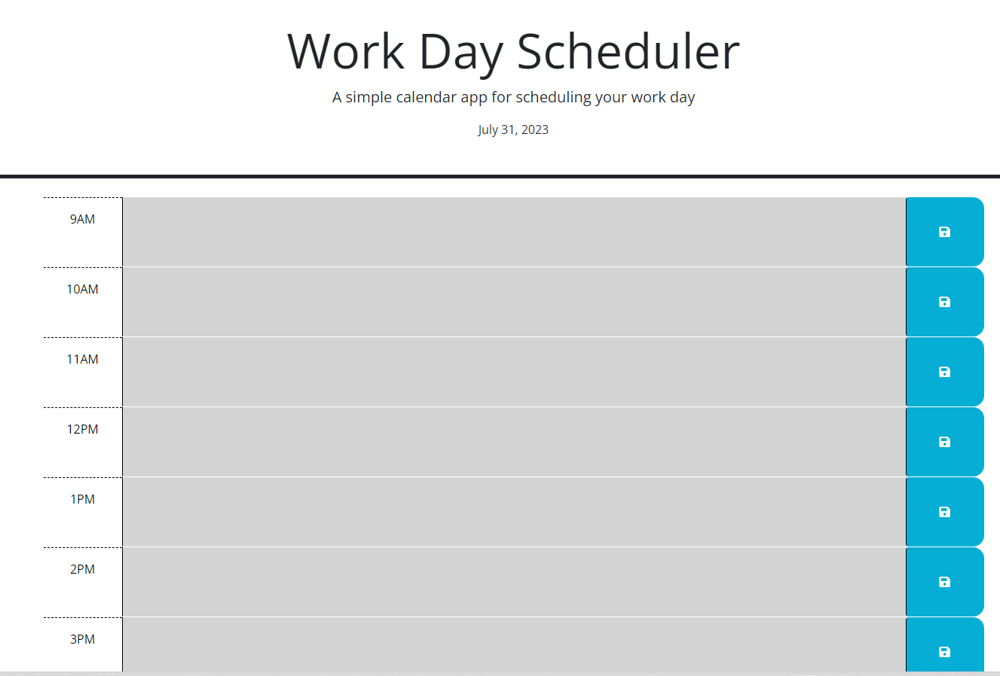

# DailyPlanner
## Description

This webpage helps someone working from 9AM to 5PM schedule there day as they type it in and save with the save button. The webpage will also change color depending on the time of day. Grey for past, red for present, and green for future.

- Help people schedule there day
- It is essential to have a daily planner to keep track of your day.
- Helps people keep track of there day.
- I learned how to use day.js and how to use local storage.

## Credits

ChatGPT
Github Copilot
Matteo Ramazzini

## Usage

Select the hour you want to write your meeting or lunch hour with. Once you write it in you can save it with the save button. The webpage will also change color depending on the time of day. Grey for past, red for present, and green for future.

()
## License

Copyright (c) [2023] [Bret Kruse]

Permission is hereby granted, free of charge, to any person obtaining a copy
of this software and associated documentation files (the "Software"), to deal
in the Software without restriction, including without limitation the rights
to use, copy, modify, merge, publish, distribute, sublicense, and/or sell
copies of the Software, and to permit persons to whom the Software is
furnished to do so, subject to the following conditions:

The above copyright notice and this permission notice shall be included in all
copies or substantial portions of the Software.

THE SOFTWARE IS PROVIDED "AS IS", WITHOUT WARRANTY OF ANY KIND, EXPRESS OR
IMPLIED, INCLUDING BUT NOT LIMITED TO THE WARRANTIES OF MERCHANTABILITY,
FITNESS FOR A PARTICULAR PURPOSE AND NONINFRINGEMENT. IN NO EVENT SHALL THE
AUTHORS OR COPYRIGHT HOLDERS BE LIABLE FOR ANY CLAIM, DAMAGES OR OTHER
LIABILITY, WHETHER IN AN ACTION OF CONTRACT, TORT OR OTHERWISE, ARISING FROM,
OUT OF OR IN CONNECTION WITH THE SOFTWARE OR THE USE OR OTHER DEALINGS IN THE
SOFTWARE.